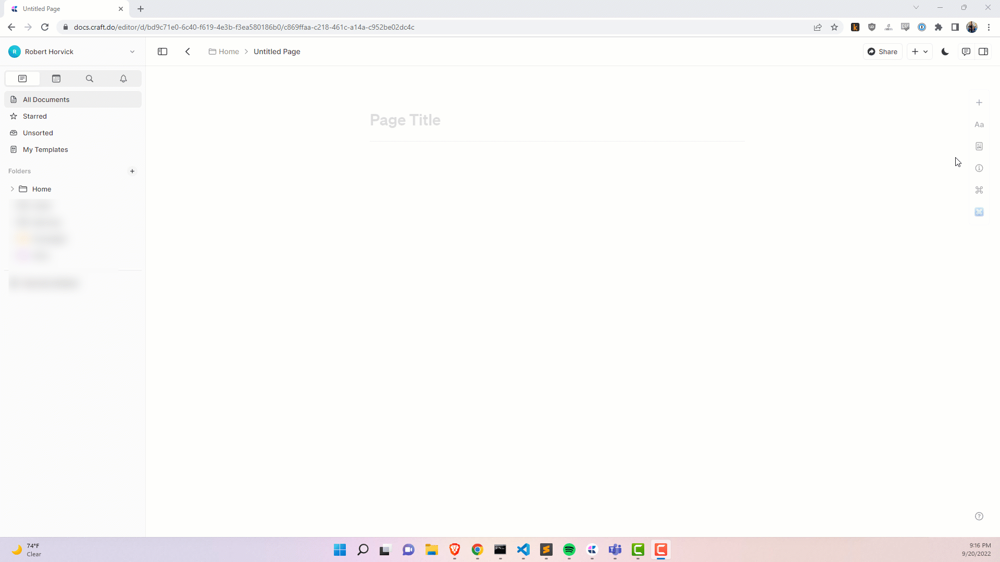

## OpenAI Demo

Uses the [OpenAI API](https://beta.openai.com/overview) to generate text from a prompt.

To use this you will need an OpenAI API Key by creating a login and finding your API key under your account settings. You'll also need to build and install the extension using the information in the "Building" section below.

## Caveats

This is not production code. I made this between meetings one day. I don't really know Javascript that well and I suck a web development in general. I stumbled around until I found things that worked and then I committed those things. Do not rely on this for anything other than mild amusement at my expense.

## Building

Simply run `npm install` and than `npm run build` to generate the .craftX file which can be installed.

You can use `npm run dev` to test and debug in your local environment

To learn more about Craft eXtensions visit the [Craft X developer portal](https://developer.craft.do).
